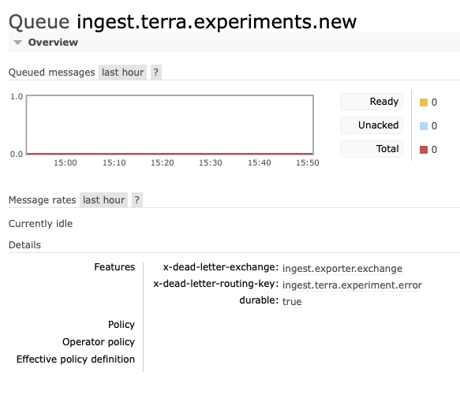

# [Dead Letter Queues](https://www.rabbitmq.com/dlx.html)

The `x-dead-letter-exchange` and `x-dead-letter-routing-key` arguments can only be added to a queue upon creation. 

Therefore: to add these to an existing queue, the queue must be **deleted** and **recreated**. which will destroy bindings that must be recreated as well.

A further issue is that any connected clients using the queue will usually create a missing queue, so connecting clients must first be disconnected, to give us time to issue the creation manually.

0) Make a note of the current ingest-exporter deployment scale, X
```.shell
kubectl get deployments
```
1) Disconnect any clients by scaling down the existing exporter deployment:
```.shell
kubectl scale deployment/ingest-exporter --replicas=0
```
2) Connect the remote rabbit admin port to your local machine:
```.shell
kubectl port-forward rabbit-0 5672:5672
```
3) run the python script:
```.shell
python ./setup_dlq.py
```
4) Reconnect exporter clients by scaling up the exporter deployment:
```.shell
kubectl scale deployment/ingest-exporter --replicas=X
```
5) You can now end the port forward for the admin port and instead connect to the web admin port to ensure that the queues have been defined appropriately.
```.shell
kubectl port-forward rabbit-0 15672:15672
```
 